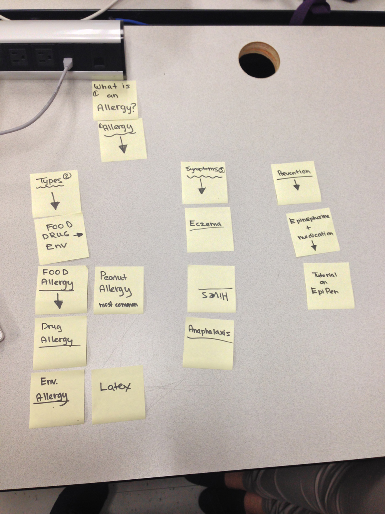
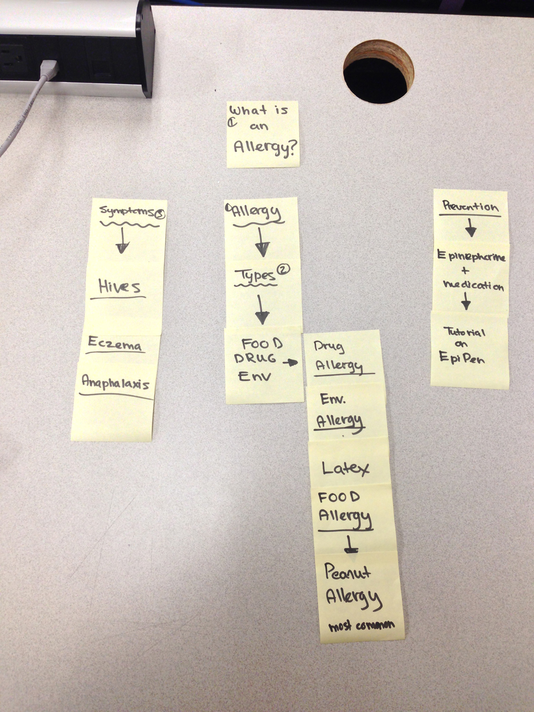

# Card sort report

The purpose of this card sort was to determine common navigation patterns and categories from the content of {your large data-oriented website}.

## Specifics

The card sort was conducted by Steven Donegani on Sept 10, 2013 between the times of 15:00 and 18:00 with the following participants:

- Amy Brown
- Cassie Slack

### Cards

16 cards were used covering a broad range of applicable content for the website. The following topics were used as cards:

1. Allergy
2. What is an allergy
3. Types
4. Symptoms
5. Tutorial on Epipen
6. Hives
7. Eczema
8. Anaphalaxis
9. Food, Drug, Env.
10. Drug Allergy
11. Env Allergy
12. Latex
13. Food Allergy
14. Peanut Allergy
15. Prevention
16. Epinepherine & Medication

## Card sort results

*Card sort 1 by Amy Brown*

*Card sort 2 by Cassie Slack*

## Observations

- Did the participants have any common comments? Nothing in particular
- Did they have questions that stood out? No
- Did they struggle with certain articles or topics? No
- Did they find common groupings? Or were the groupings completely different? Yes they were very easily to find common groupings
- Were some of the groupings completely unexpected? No
- Were the results similar to your expectations? Yes
- How did you feel while watching them perform the task? It felt good watching them organize them in similar fashions.